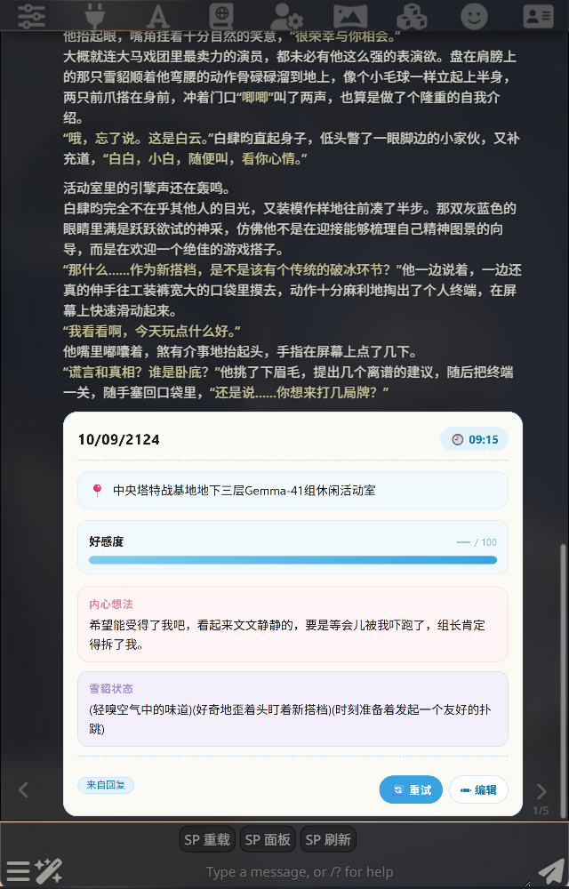

# 状态面板 · 指南

在每条 AI 回复下方显示一张实时状态卡——心情、位置、数值——定义写进角色卡，导出时一起带走。

> English: [AUTHOR.md](AUTHOR.md) · 样式参考：[样式.md](样式.md)

## 按钮与标签页

打开 TavernHelper 脚本工具栏，点 **SP 面板**——唯一的按钮。它会打开一个设置窗口（会跟随你的
SillyTavern 主题），里面有四个标签页：

- **字段** —— 添加每个字段：名称、类型（文本 / 数字 / 枚举）、示例值。保存。
- **生成** —— 数值如何被填入（见下文），并实时预览注入的指令。
- **样式** —— **简易**（滑块 + 取色器，不用写代码）或 **高级**（粘贴你自己的 HTML + CSS）。
  完整选择器列表见 [样式.md](样式.md)。想让 AI 帮你写 CSS？用 [styles-prompt.md](styles-prompt.md)
  里的 prompt。
- **管理** —— 按角色启用、停用或删除面板，并清除已存数据。

每个面板下方有两个操作：**🔄 重试** 重新生成数值，**✏ 编辑** 让你手动修改。**复制状态块** 会复制
一段现成的块——粘到开场白里，打开对话面板就会自动填好。

## 数值如何被填入 —— 两种模式

1. **追加进提示词（自动）。** 只要面板已启用且有字段，每一次请求都会被悄悄加上一小段指令，
   要求 AI 在回复里输出这些数值。没有开关——始终开启。这样填入的数值，徽章显示 **来自回复**。
2. **仅重试（按需）。** 点 **🔄 重试** 会发出一次单独的一次性请求，*只*索取这些数值，然后写回
   （**已生成**，失败则 **生成失败**——旧数值会保留）。除此之外不会自动生成任何东西；空面板只会
   显示破折号，直到 AI 填好或你点重试。

## 徽章说明

来自回复 = AI 自己写的 · 已生成 = 你点了重试 · 手动 = 你手动改的 · 生成失败 = 重试失败。

**面板没出现？** 这个角色需要同时有定义**并且**被你同意（启用）——去 **管理** 标签页检查。
