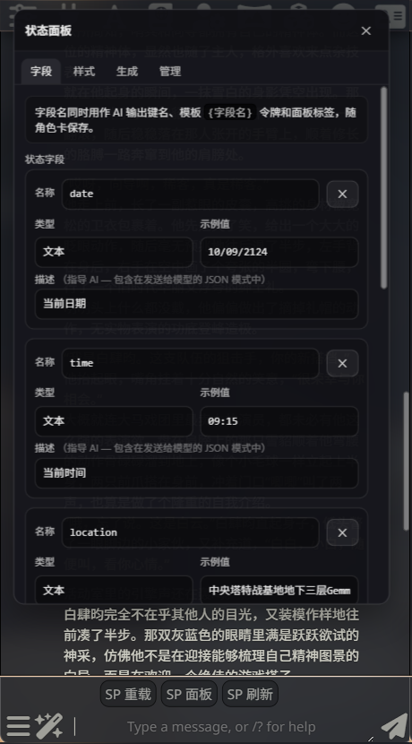
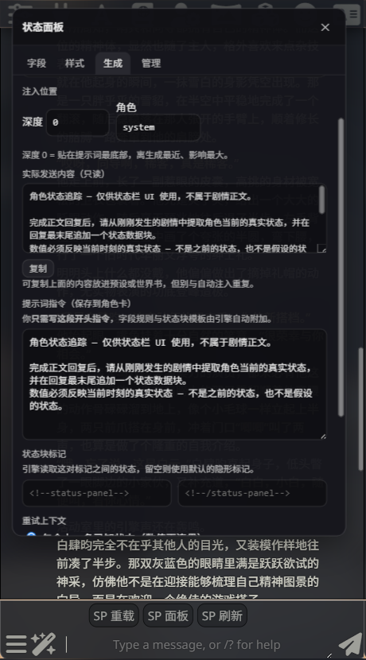
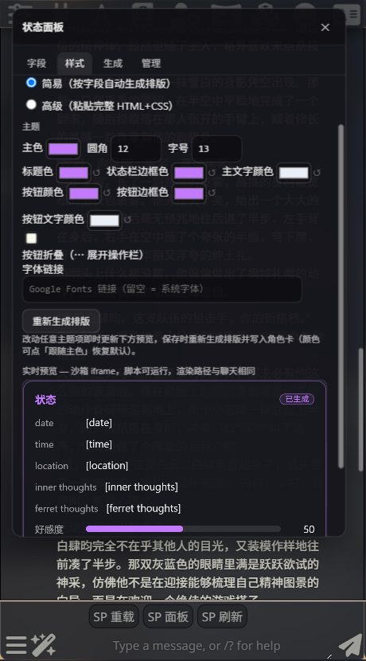
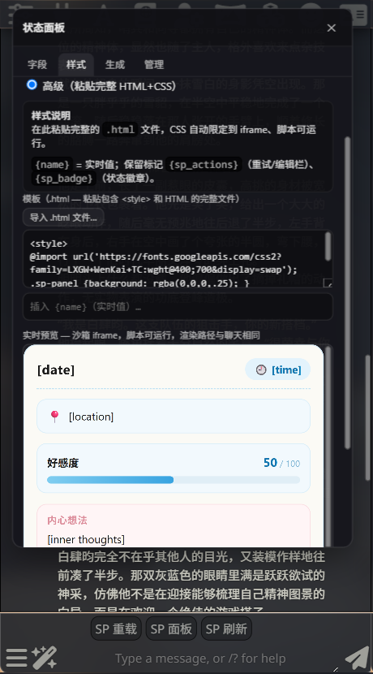
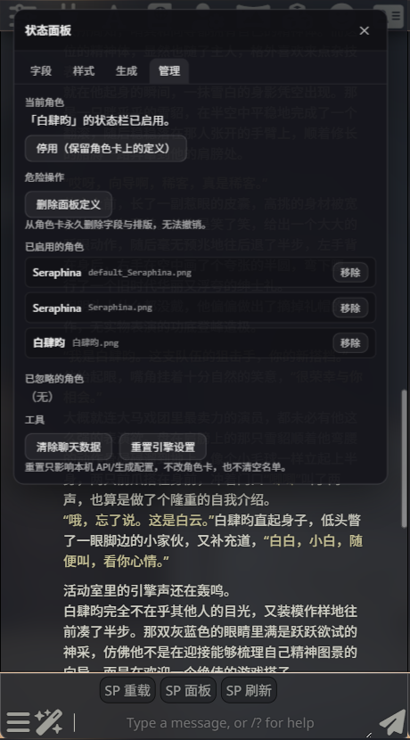

# 状态面板 · 指南

在每条 AI 回复下方显示一张实时状态卡——心情、位置、数值——定义写进角色卡，导出时一起带走。


> English: [AUTHOR.md](AUTHOR.md)

---

## 一、如何设置

打开 TavernHelper 脚本工具栏，点 **SP 面板**。



- **字段** —— 添加每个字段：名称、类型（文本 / 数字 / 枚举）、示例值。保存。
- **生成** —— AI 会被自动要求在每条回复里输出这些值，无需手动开关。
- **管理** —— 按角色启用、停用或删除面板。



快捷方式：**复制状态块** 会复制一段现成的块——粘到开场白里，打开对话面板就会自动填好。

---

## 二、如何美化

打开 **样式** tab，两种模式：

### 简易 —— 不用写代码

滑块和取色器，实时预览：选主色、圆角、字体，然后保存。



### 高级 —— 完全自定义

一个文本框，粘贴 HTML 加一段 `<style>`，边打边预览。



渲染时会替换三个**令牌（token）**：

| 令牌 | 会变成 |
|---|---|
| `{字段名}` | 该字段当前存储的值（空值 → 灰色 `—`） |
| `{sp_actions}` | 🔄 重试 / ✏ 编辑 按钮 |
| `{sp_badge}` | 来源徽章 |

所有内容都在一个窄（约 380 像素）的沙箱框里渲染，聊天样式进不来，你的样式也漏不出去。**唯一铁律：一定要自己写 `background`**——默认没有背景，否则文字会直接飘在聊天气泡上。

示例——字段 `mood`、`location`、`inner_thoughts`：

```html
<div class="panel">
  <div class="card"><span class="lbl">MOOD</span><span class="val">{mood}</span></div>
  <div class="card"><span class="lbl">WHERE</span><span class="val">{location}</span></div>
  <div class="card wide"><span class="lbl">THOUGHTS</span><span class="val">{inner_thoughts}</span></div>
  <footer class="foot">{sp_badge}{sp_actions}</footer>
</div>
<style>
  /* REQUIRED — the frame is transparent, so paint your own surface */
  .panel { background:#1a1420; color:#eadfff; font:13px/1.5 system-ui, sans-serif;
           display:grid; grid-template-columns:1fr 1fr; gap:8px;
           padding:10px; border-radius:12px; max-width:380px; }
  .card { background:rgba(255,255,255,.05); border-radius:10px; padding:8px 10px; }
  .wide { grid-column:1 / -1; }                 /* one full-width row */
  .lbl  { font-size:10px; opacity:.6; letter-spacing:.08em; text-transform:uppercase; }
  .val  { font-size:13px; line-height:1.4; }
  .foot { grid-column:1 / -1; display:flex; align-items:center;
          justify-content:flex-end; gap:10px; }
</style>
```

按钮和徽章都是真实元素——用类名（class）来设置样式：

```css
.sp-btn-retry, .sp-btn-edit {                   /* the 🔄 / ✏ buttons */
  all:unset; cursor:pointer; padding:4px 14px; border-radius:999px;
  background:#5c6bc0; color:#fff; font:600 12px/1.4 system-ui, sans-serif;
}
.sp-btn-retry:hover, .sp-btn-edit:hover { filter:brightness(1.15); }
.sp-btn-retry:disabled { opacity:.4; cursor:not-allowed; }   /* while generating */
.sp-badge {                                     /* the source label */
  background:rgba(120,200,120,.15); color:#7ccf7c;
  border-radius:999px; padding:2px 8px; font-size:9px;
}
```

---

## 三、让 AI 帮你写 CSS

不想手写 CSS？把 **复制状态块** 的内容，配上一句风格描述，粘进下面的 prompt，用任意对话式 AI（Claude、ChatGPT……）跑一遍，把结果直接粘进高级模式。

```
You are writing a template for a "Status Panel" widget that renders inside a sandboxed,
narrow (≤380px wide) HTML iframe embedded in a chat message. Output ONE fenced code block
containing an HTML fragment with an inline <style> block — nothing else, no explanation
before or after. Do not include <!DOCTYPE>, <html>, <head>, or <body> tags.

INPUT — my status block (field name → current example value):
<PASTE YOUR 复制状态块 JSON HERE, e.g. {"心情":"平静","好感度":50}>

For each field, here is how I want it displayed (delete/edit — the JSON alone has no min/max):
<e.g. 好感度: number 0-100, progress bar. 心情: short text, pill. 内心想法: long text, paragraph.>

STYLE BRIEF: <e.g. "dark fantasy, parchment and wax-seal accents, warm amber text" or
"cute pastel, rounded corners, soft shadows">

STRUCTURE (mechanical, follow exactly):
- One token `{exact_key_name}` per field key above, byte-for-byte, no extra/renamed fields, no `{{double}}` braces.
- Include `{sp_actions}` once and `{sp_badge}` once, usually together in a footer.
- Plain selectors only — no manual `.sp-iframe-root`/`:root` prefixing, one `<style>` block.
- Target ~320-380px width — no `100vw`/`100vh`, no fixed/absolute full-page positioning.
- Any `@import url(...)` web font must be the first line of the `<style>` block.

STYLE REFERENCE — declare CSS for every row that applies to your markup:

| Target | Set these properties |
|---|---|
| whole panel; write the selector as `body`, `:root`, or `.sp-iframe-root` | `background`, `color`, `font-family`, `font-size`, `padding`, `border-radius`, `border` — no default background exists, you must declare one |
| each `{field}` token's row/element | `color`, `font-size`, `font-weight`, spacing |
| `.sp-ph`, `.sp-ph-dash` — empty-value placeholder | `color`, `opacity`, `font-style` |
| `.sp-actions-wrap` — row holding the two buttons | `display`, `gap`, `justify-content` |
| `.sp-btn-retry`, `.sp-btn-edit` — the two buttons | `background`, `border`, `color`, `border-radius`, `padding`, `font` |
| `.sp-btn-retry:hover`, `.sp-btn-edit:hover` | `background`/`filter` change |
| `.sp-btn-retry:disabled` | `opacity`, `cursor` |
| `.sp-badge` — source-status pill | `background`, `border`, `color`, `border-radius`, `font-size`, `padding` |
| `.sp-badge-error` — failure variant of the badge | `background`, `border`, `color` |
| `--sp-accent` (optional var) | any color, default `#7c9cff` |
| `--sp-radius` (optional var) | any length, default `12px` |
| `--sp-text-size` (optional var) | any length, default `13px` |
| `--sp-text-color` (optional var) | any color, default `rgba(255,255,255,.92)` |
| `--sp-title-color` (optional var) | any color, default follows `--sp-accent` |
| `--sp-border-color` (optional var) | any color, default `--sp-accent` at 42% |
| `--sp-btn-color` / `--sp-btn-border-color` / `--sp-btn-text-color` (optional vars) | any colors, default derived from `--sp-accent` |
| `--sp-font` (optional var) | any font stack, default system UI |

Optional vars only apply where you write `var(--name)` yourself — hard-coded colors work
just as well. Now produce the complete HTML+CSS block.
```

---

## 四、徽章说明（给玩家）

徽章显示这些数值从哪来：

| 徽章 | 含义 |
|---|---|
| 来自回复 | AI 在回复里自己写出来的 |
| 已生成 | 你点了 🔄 重试 |
| 手动 | 你手动改的（✏ 编辑） |
| 生成失败 | 重试失败了——旧数值会保留，可以再点一次 🔄 |



**面板没出现？** 这个角色需要同时有定义**并且**被你同意（启用）——去上图的 **管理** tab 检查。
